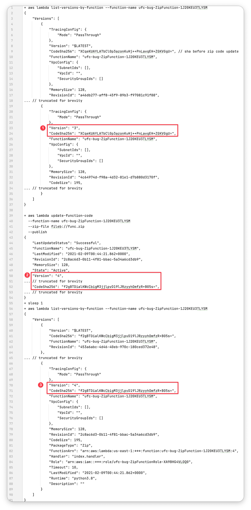
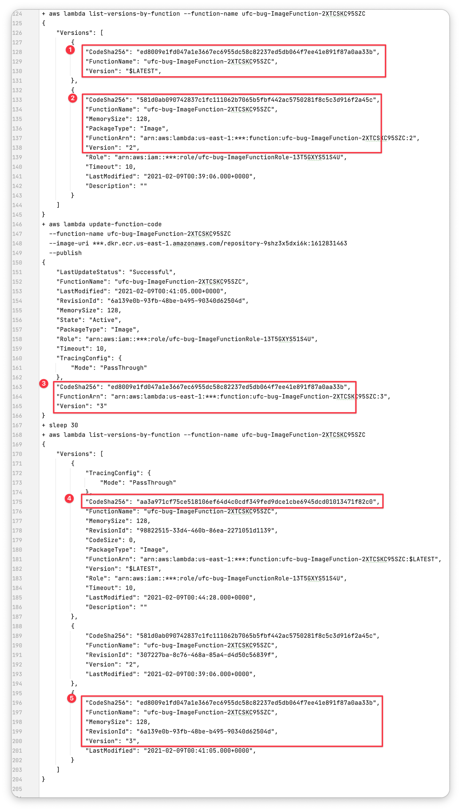

There appears to currently be a bug with the AWS Lambda `UpdateFunctionCode` API.
Specifically, the `--publish` flag does not work correctly for container image-based 
functions. It appears to publish a new version and return the information for the
`$LATEST` version _before_ the image that is currently being uploaded. This is
different to ZIP file scenario, wherein it creates a version from the ZIP that is
currently being uploaded.

Discussion will follow the reproduction.

## Reproduction

This is a screenshot of truncated logs when calling `UpdateFunctionCode` for a 
ZIP-based Lambda function. 

The box annotated "1" shows that before updating the function, the newest version
is `3` and has a CodeSha256 beginning with `XCq`. 

The box annotated "2" shows that the response returned by `UpdateFunctionCode` has
a version of `4` and a CodeSha256 beginning with `f2g`.

The box annotated "3" shows that a second after updating the function, the latest
function is version `4` and has a CodeSha256 beginning with `f2g` as expected.

Now compare that to the next screenshot, which is for a container-based Lambda
function.

The box annotated "1" shows that before updating the function, the unversioned
`$LATEST` has a CodeSha256 beginning `ed8`.

The box annotated "2" shows that before updating the function, latest version is 
`2` and has a CodeSha256 beginning with `581`. 

The box annotated "3" shows that the response returned by `UpdateFunctionCode` has
a version of `3` and a CodeSha256 beginning with `ed8` **but this is the version
that already existed**.

The box annotated "4" shows that 30 seconds after updating the function, the 
unversioned `$LATEST` has a CodeSha256 beginning `aa3`. **This is the code
we just uploaded.**

The box annotated "5" shows that the latest version is "3" and  has a CodeSha256 
beginning with `ed8` - this is the already-existing version. No version was ever
by our `UpdateFunctionCode` call (in annotated box 3).

## Discussion

This feels like a bug, right? It was at least surprising to me: the behaviour
of `UpdateFunctionCode` with `--publish` is different for ZIP functions and image
functions. For the former, it creates and publishes a version from the provided
ZIP file. For the latter, it creates a version from whatever was there previously
- and doesn't create one for the provided image.

My understanding from working on this is that the `$LATEST` version of image-based
functions is updated asynchronously. I guess this makes sense, given they can be
up to 10 GB. And that likely has ramifications for versioning, i.e. they can't
return a version number for a function that isn't ready yet. **But in that case,
I think passing the `--publish` flag should return an exception**. I can't
see any benefit to the current behaviour.

Please ping me on Twitter (I am [@__steele](https://twitter.com/__steele)) and let
me know if you disagree. I'm very open to being corrected on this.
